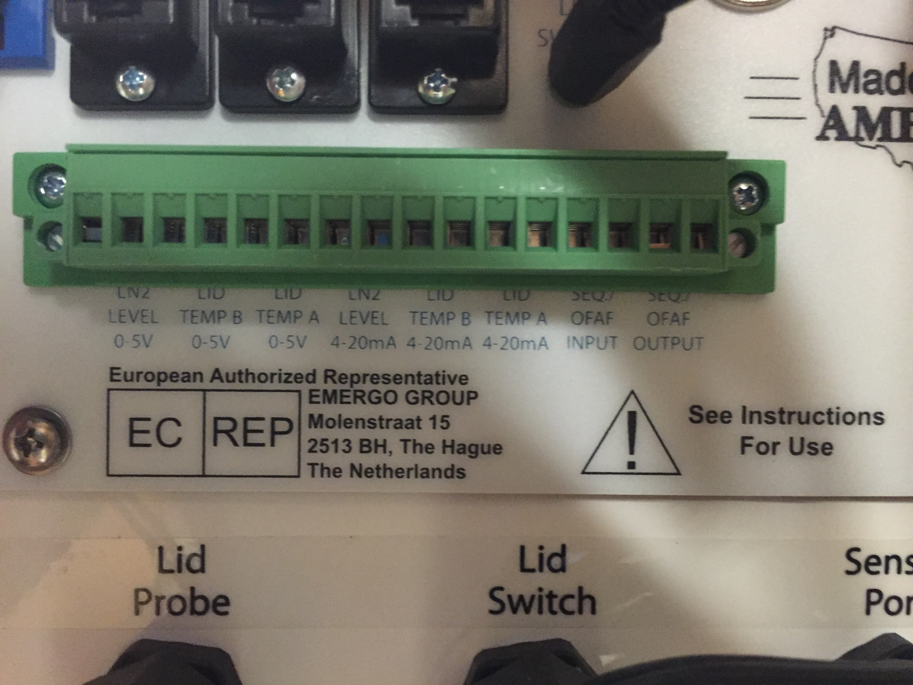

# Resources for hooking up to the LN2 tank

## Interfacing with the back panel

Here you can see that simple wire leads can be plugged into the back of the panel into the ports labelled as 0-5V.

The biogenics manual says the ranges are:
- temp: +55 to -200C
- level: 0 to 33 inches

## analoougue to digital conversion

- Using an ADC (analogue to digital converter) to interface like those available from adafruit
	- [link](https://www.adafruit.com/products/1083?gclid=CjwKEAjwk6K8BRDM3aCSkdCtzSQSJAA3Vf38rcx3qXdMl0GTGCH5S8iKIgM06vSdwzxo8IAfB37wRxoCxKnw_wcB)
	
- interface via SPI or I2C (both available as kernel drivers)

## Resources

- biogenics manual: our machine is 2301
	- [link](http://www.custombiogenics.com/Information/Manuals/isothermal-standardfreezermanuals/2301%20Manual/2301Manual/2301%20Manual.pdf)